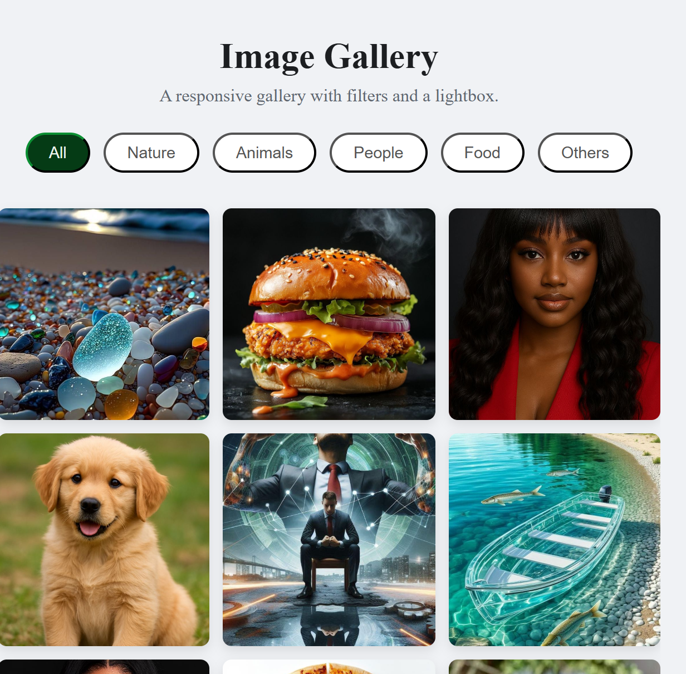

# Responsive Image Gallery

A fully responsive image gallery built with HTML, CSS, and vanilla JavaScript. This project features a clean, modern design with smooth animations, category filtering, and a functional lightbox for viewing images.

### [View Live Demo]([https://code-alpha-image-gallary-beta.vercel.app/])



## Project Description

This project was created as part of the CodeAlpha Internship Program to practice and showcase core front-end development skills. It focuses on building a clean, responsive image gallery using HTML, CSS, and JavaScript. The images used in this project were sourced from Pinterest for demonstration purposes.

## Features

- **Responsive 3-Column Grid:** A clean and modern grid that looks great on all screen sizes.
- **Category Filtering:** Filter the images by category with smooth, animated transitions.
- **Lightbox Gallery:** Click on any image to open it in a full-screen, focused view.
- **Easy Navigation:**
  - Next and Previous buttons to cycle through images within the lightbox.
  - Keyboard navigation (Arrow Keys for next/prev, Escape to close).
- **Smooth Hover Effects:** A subtle zoom effect on each image in the grid to improve user interaction.

## Technologies Used

- **HTML5:** For the structure and content of the gallery.
- **CSS3:** For all styling, including the responsive grid (CSS Grid), animations, transitions, and the lightbox layout.
- **JavaScript (ES6):** For all interactivity, including filtering logic, opening/closing the lightbox, and handling navigation.
- **Font Awesome:** For clean and scalable icons on the navigation and close buttons.

## How to Run Locally

To run this project on your own machine, follow these simple steps:

1.  **Clone or download the repository:**

    ```sh
    git clone https://github.com/Danielambrose-web/CodeAlpha-Image-Gallary.git
    ```

    (Or, just download the ZIP file and extract it.)

2.  **Navigate to the project folder:**

    ```sh
    cd CodeAlpha-Image-Gallary
    ```

3.  **Open the `index.html` file:**
    Simply double-click the `index.html` file in the project folder to open it in your default web browser.

## Acknowledgements

- Icons provided by [Font Awesome](https://fontawesome.com/).
- Images sourced from [Unsplash](https://pinterest.com/).
